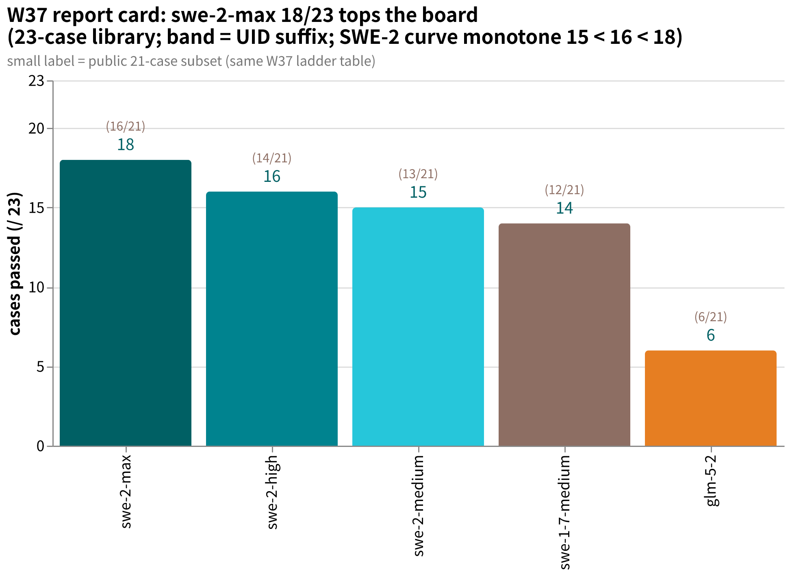
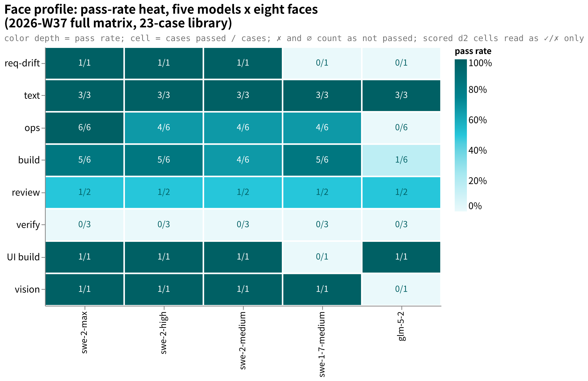

# amber-devin

Public periodic [AMBER](https://github.com/getaskclaw/amber) benchmark results of Devin models (swe family and friends, across reasoning-effort bands). **Cases stay private; results are public.** 中文说明：[README.md](README.md)

## What this is

- One `results/YYYY-Www.md` per issue: same cases, same harness, full library per model; effort bands side by side.
- Each issue pins: library size and hashes, per-case defect-hunt score and pass/fail, terminal states, token usage (when the lane reports it) and latency, environment fingerprint, and a qualitative verdict written under evidence discipline.
- Cases, oracles, transcripts and intermediates are **never published**.
- Sister repos: [amber-gpt](https://github.com/getaskclaw/amber-gpt), [amber-crof](https://github.com/getaskclaw/amber-crof), [amber-ollama](https://github.com/getaskclaw/amber-ollama), [amber-workbuddy](https://github.com/getaskclaw/amber-workbuddy) (WorkBuddy ACP lane).

## Publication red lines

1. Publish only: scores and aggregates, token usage (when reported), speed, qualitative verdicts.
2. Never publish: case content, oracles/graders, transcripts, candidate workspaces, anything that could reconstruct a case.
3. Every issue pins: model ID, effort band, date (UTC), harness version, per-case bundle hash — verifiable against the public hash index in [amber](https://github.com/getaskclaw/amber).
4. Case numbering is private: public matrices use stable aliases (A-xxxxxxxx, hash-derived) plus bundle hashes only.
5. Tone: community measurement, not vendor attacks.

## Charts

- **Report card** (2026-W37, 23-case library; figures from the issue's ladder table): swe-2-max 18/23 tops the board, SWE-2 band curve medium 15 < high 16 ≈ high re-run 15 < max 18 ([correction 2026-09-18](results/2026-W37.md): the results originally labeled swe-2-low were actually a swe-2-high re-run; the old curve low 15 = medium 15 is withdrawn); swe-1-7-medium 14/23, glm-5-2 6/23; small labels = public 21-case subset.
  
- **Face profile** (2026-W37 full matrix, face x model heatmap; color depth = per-face pass rate): swe-2-max sweeps ops 6/6 — the lane's only sweep (earlier suite-wide sweeps: gpt luna ×3, ollama g53f); all four SWE-2 bands pass UI build; verify is 0/3 for every model.
  

## Results index

| Issue | Content | Headline |
|---|---|---|
| [2026-W37](results/2026-W37.md) | swe-1-7-medium + glm-5-2 + swe-2-high + swe-2-medium + swe-2-max + swe-2-low, 23-case library | **swe-2-max 18/23 (16/21) — new suite-wide board top**, band curve medium 15 < high 16 ≈ high re-run 15 < max 18 ([correction 2026-09-18](results/2026-W37.md): swe-2-low does not exist; that run was actually swe-2-high), the lane's only OPS 6/6 sweep, at ~4× the wall clock; swe-2-medium 15/23 fastest full library (43 min) with best-ever vision 4.0; swe-2-high re-run 15/23 ties medium but keeps the heavy-judgment cases (originally labeled swe-2-low, Addendum 2026-09-12); swe-1-7-medium's review scalp stays uninherited; glm-5-2 6/23, delivery-contract failure = operational disqualifier |

## Disclaimer

Not affiliated with or sponsored by Cognition. Scores are dated, band-specific snapshots, not purchasing advice.
