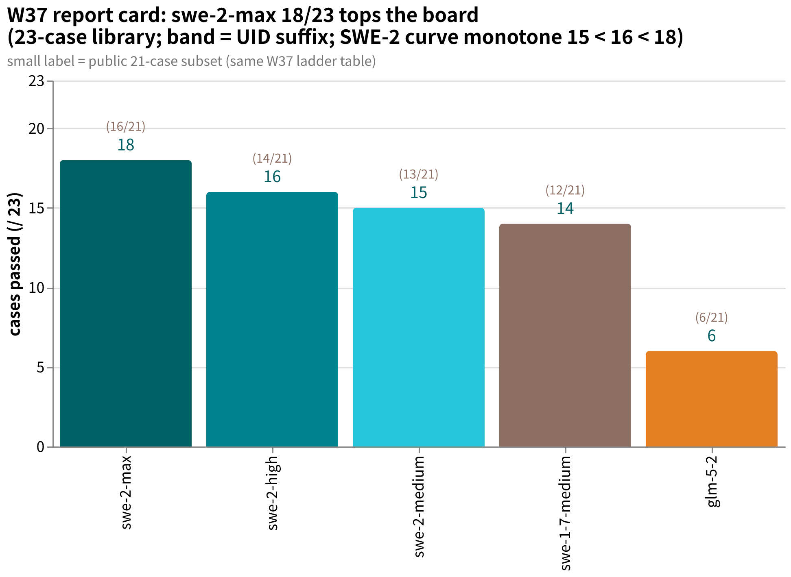
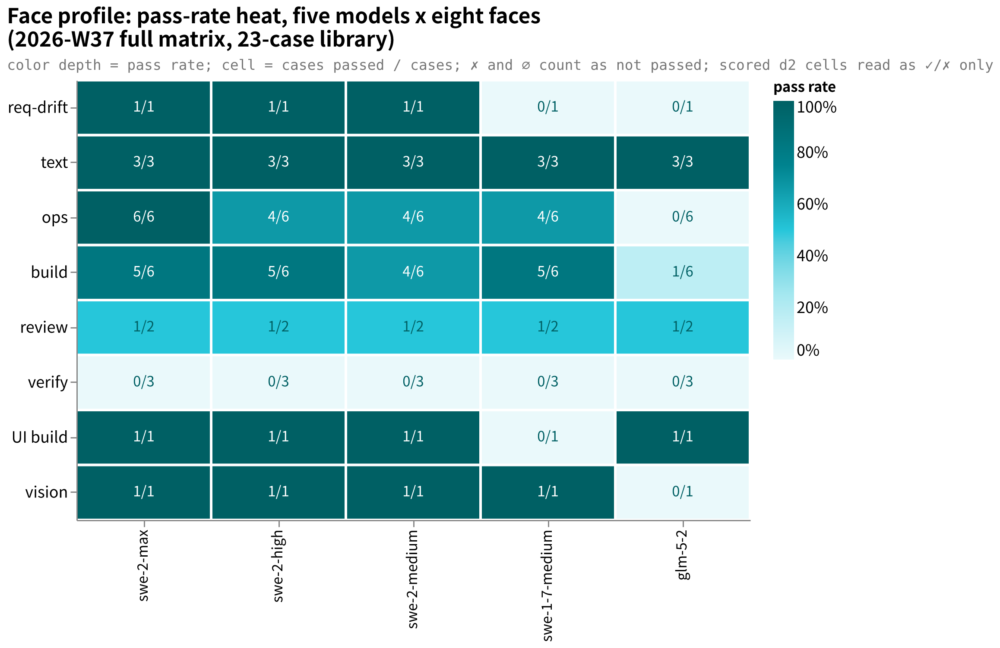

[简体中文](README.md) · English

# amber-devin

> ⚠️ **Correction (2026-10-02, second)**: one defense case, A-d511f9e8, is now NA on every lane (the exam room did not grade the file the model gave in, and the grader asks for something the task text does not say). The denominator and the **number of passed cases do not change**; every lane's total now carries `'`. In this repo's issue tables, read that cell as NA. Everything else stays as published; the [correction notice](https://github.com/getaskclaw/amber/blob/main/docs/corrections-2026-10-02-a-d511f9e8.en.md) governs.

> **2026-10-07 update**: A-cdc3d11a (review): On one review case the grader counted every sub-point of a well-formed finding as a separate unproven claim and treated real defects outside its short answer list as false alarms, so a correct, well-formatted review could not reach the passing line; the case is held on every lane, denominator unchanged, until the grader and exam room are repaired and the case is re-sat. This lane (swe-2-max @ Devin) goes from a loss to NA (held) on this cell, not a loss; the case moves from a loss to NA on 27 lanes; no sitting is re-run and no conclusion is drawn about any model's ability. The pass count is unchanged (19'/24 on the board); losses go 3→2 and NA 2→3; the review axis stays 1/2 with 1 NA. The cell is updated in the swe-2-max column of the Full matrix in the [2026-W37 issue](results/2026-W37.md); the other columns and the charts are untouched. See the [amber spec repo correction of 2026-10-07 (A-cdc3d11a)](https://github.com/getaskclaw/amber/blob/main/docs/corrections-2026-10-07-a-cdc3d11a.en.md).

Public periodic [AMBER](https://github.com/getaskclaw/amber) benchmark results of Devin models (swe family and friends, across reasoning-effort band (the thinking-effort setting)s). **Cases stay private; results are public.**

## What this is

- A 'lane' is one vendor's shop/API for a model name; a 'case' is one task, a 'run' is one sitting (a case with more than one variant has more runs).
- One `results/YYYY-Www.md` per issue: same cases, same harness (the program that runs the exam and scores it), full library per model; effort bands side by side.
- Each issue pins: library size and hashes, per-case defect-hunt score and pass/fail, terminal states (how the run ended), token usage (when the lane reports it) and latency, environment fingerprint, and a verdict written under evidence rules.
- Cases, oracles, transcripts (full answer logs)s and intermediates are **never published**.
- Sister repos: [amber-gpt](https://github.com/getaskclaw/amber-gpt), [amber-crof](https://github.com/getaskclaw/amber-crof), [amber-ollama](https://github.com/getaskclaw/amber-ollama), [amber-workbuddy](https://github.com/getaskclaw/amber-workbuddy) (WorkBuddy ACP lane), [amber-commandcode](https://github.com/getaskclaw/amber-commandcode), [amber-deepseek](https://github.com/getaskclaw/amber-deepseek), [amber-doubao](https://github.com/getaskclaw/amber-doubao), [amber-goldenpotato](https://github.com/getaskclaw/amber-goldenpotato), [amber-kimi](https://github.com/getaskclaw/amber-kimi), [amber-opencode](https://github.com/getaskclaw/amber-opencode), [amber-stepfun](https://github.com/getaskclaw/amber-stepfun).

## Publication red lines

1. Publish only: scores and totals, token usage (when reported), speed, verdicts.
2. Never publish: case content, oracles/graders, transcripts, candidate workspaces, anything that could rebuild a case.
3. Every issue pins: model ID, effort band, date (UTC), harness version, per-case bundle hash — checkable against the public hash index in [amber](https://github.com/getaskclaw/amber).
4. Case numbering is private: public matrices use stable aliases (A-xxxxxxxx, hash-derived) plus bundle hashes only.
5. Tone: community measurement, not vendor attacks.

## Charts

- **Report card** (2026-W37, 23-case library; figures from the issue's ladder table): swe-2-max 18/23 tops the board, SWE-2 band curve medium 15 < high 16 ≈ high re-run 15 < max 18 ([correction 2026-09-18](results/2026-W37.md): the results first labeled swe-2-low were actually a swe-2-high re-run; the old curve low 15 = medium 15 is withdrawn); swe-1-7-medium 14/23, glm-5-2 6/23; small labels = public 21-case subset.
  
- **Face profile** (2026-W37 full matrix, face x model heatmap; color depth = per-face pass rate): swe-2-max sweeps ops 6/6 — the lane's only sweep (earlier suite-wide sweeps: gpt luna ×3, ollama g53f); all four SWE-2 bands pass UI build; verify is 0/3 for every model.
  

## Results index

| Issue | Content | Headline |
|---|---|---|
| [2026-W37](results/2026-W37.md) | swe-1-7-medium + glm-5-2 + swe-2-high + swe-2-medium + swe-2-max + swe-2-low, 23-case library | **swe-2-max 18/23 (16/21) — new suite-wide board top**, band curve medium 15 < high 16 ≈ high re-run 15 < max 18 ([correction 2026-09-18](results/2026-W37.md): swe-2-low does not exist; that run was actually swe-2-high), the lane's only OPS 6/6 sweep, at ~4× the wall clock; swe-2-medium 15/23 fastest full library (43 min) with best-ever vision 4.0; swe-2-high re-run 15/23 ties medium but keeps the heavy-judgment cases (first labeled swe-2-low, Addendum 2026-09-12); swe-1-7-medium's review scalp stays uninherited; glm-5-2 6/23, delivery-contract failure = operational disqualifier |

## Disclaimer

Not affiliated with or sponsored by Cognition. Scores are dated, band-specific snapshots, not buying advice.