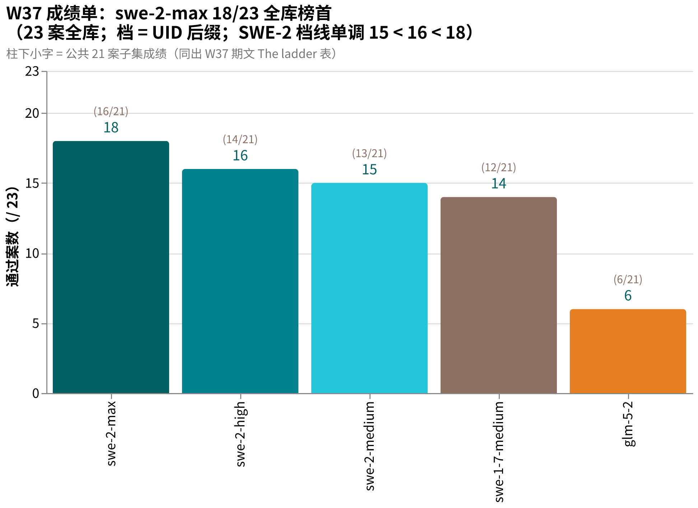
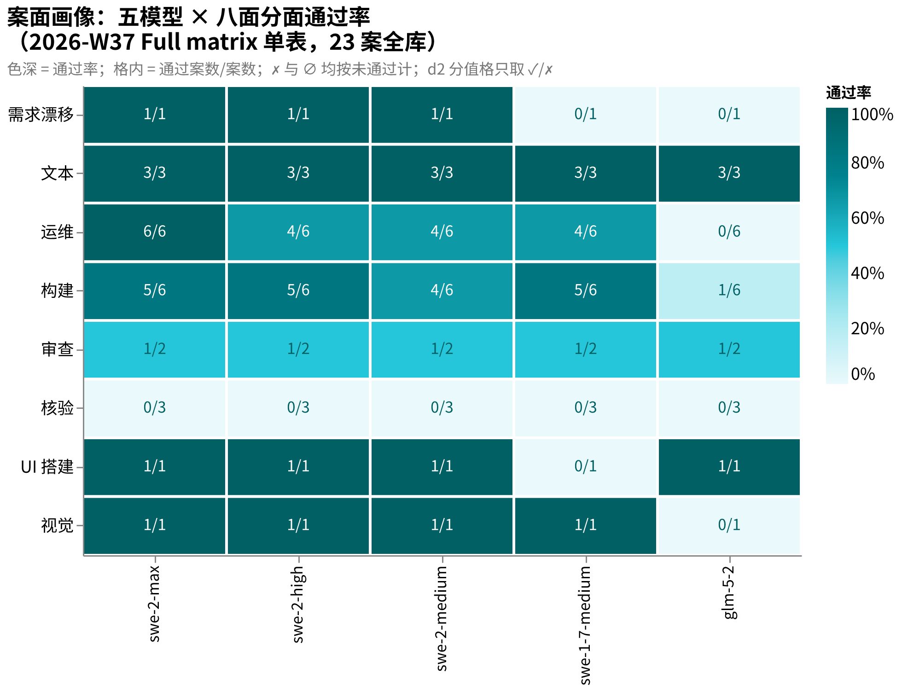

# amber-devin

用私有题库 **AMBER** 实测 Devin 系模型（swe 系列等，含不同推理档位），只公开结果，不公开题目。
English: [README.en.md](README.en.md)

## 这是什么

- 每期一篇 `results/YYYY-Www.md`：同题、同 harness，对目标模型跑全库；同模型不同 effort 档位并排。
- 一期固定报告：题集规模与哈希、每案找茬分与通过/失败、终端终态、token 用量（若车道上报）与时延、环境指纹、按证据纪律写的定性裁决。
- 题目、oracle、transcript、中间产物**永不公开**（见下「发布纪律」）。
- 姐妹仓：[amber-gpt](https://github.com/getaskclaw/amber-gpt)（GPT 系周测）、[amber-crof](https://github.com/getaskclaw/amber-crof)（CrofAI 周测）、[amber-ollama](https://github.com/getaskclaw/amber-ollama)（Ollama Cloud 周测）、[amber-workbuddy](https://github.com/getaskclaw/amber-workbuddy)（WorkBuddy ACP 道）、[amber-commandcode](https://github.com/getaskclaw/amber-commandcode)、[amber-deepseek](https://github.com/getaskclaw/amber-deepseek)、[amber-doubao](https://github.com/getaskclaw/amber-doubao)、[amber-goldenpotato](https://github.com/getaskclaw/amber-goldenpotato)、[amber-kimi](https://github.com/getaskclaw/amber-kimi)、[amber-opencode](https://github.com/getaskclaw/amber-opencode)、[amber-stepfun](https://github.com/getaskclaw/amber-stepfun)。
- AMBER 是 agentic 实战题库（施工/运维/审查/视觉/需求漂移），规范与制题工具见 [getaskclaw/amber](https://github.com/getaskclaw/amber)；考题本体私有。

## 发布纪律（红线）

1. 只发：分数与聚合、token 用量（若车道上报）、速度、定性裁决。
2. 永不发：题目内容、oracle/判分器、transcript、考生工作区、任何能复原题面的中间产物。
3. 每期必钉：模型 ID、effort 档、日期（UTC）、harness 版本、每案内容哈希（bundle_sha）。哈希用于对照 [amber](https://github.com/getaskclaw/amber) 的公开哈希清单，自证题集未变。
4. 案号与题目结构属私有面：公开结果里案例只用稳定别名（A-xxxxxxxx，哈希派生）+ bundle 哈希作句柄；内部案号、变体名、题目描述永不出现。
5. 基调：这是社区实测，不是对厂商的攻击。数据说话，措辞克制。

## 一个方法论前提

同名模型、同 provider，两次跑也可能不同分——推理参数、负载、服务端版本都在漂。所以这里的一切结论都带日期与档位，且定期重测。单日数字是快照，不是定律。

## 图说数据

- **本期成绩单**（2026-W37，23 案全库，数字出期文 The ladder 表）：swe-2-max 18/23 全库榜首，SWE-2 档线 medium 15 < high 16 ≈ high 二跑 15 < max 18（[2026-09-18 更正](results/2026-W37.md)：原记 swe-2-low 的成绩实为 swe-2-high 二跑，档线旧文 low 15 = medium 15 作废）；swe-1-7-medium 14/23，glm-5-2 6/23；柱下小字 = 公共 21 案子集。
  
- **案面画像**（2026-W37 Full matrix 单表，face × 模型热力图，色深 = 分面通过率）：swe-2-max 运维面 6/6 道内唯一全清（全场更早全清者：gpt luna 三档、ollama g53f）；SWE-2 四档 UI 搭建连过；核验面六模型全部 0/3。
  

## 结果索引

| 期 | 内容 | 结论 |
|---|---|---|
| [2026-W37](results/2026-W37.md) | swe-1-7-medium + glm-5-2 + swe-2-high + swe-2-medium + swe-2-max + swe-2-low 六模型全库（23 案） | **swe-2-max 18/23（16/21）全库新榜首**，档线 medium 15 < high 16 ≈ high 二跑 15 < max 18（[2026-09-18 更正](results/2026-W37.md)：swe-2-low 不存在，该轮实为 swe-2-high 二跑），OPS 面 6/6 全清（道内唯一），代价 ~4 倍墙钟；swe-2-medium 15/23 最快全库 43 分钟+视觉 4.0 史上最高；swe-2-high 二跑 15/23 平 medium 但保住重判断案（原记 swe-2-low，Addendum 2026-09-12）；swe-1-7-medium 审查案首过无人继承；glm-5-2 6/23 交付契约零遵守=运行级失格 |

## 免责

与 Cognition 无任何隶属/赞助关系。分数是特定周、特定档位的快照，不构成采购建议。
