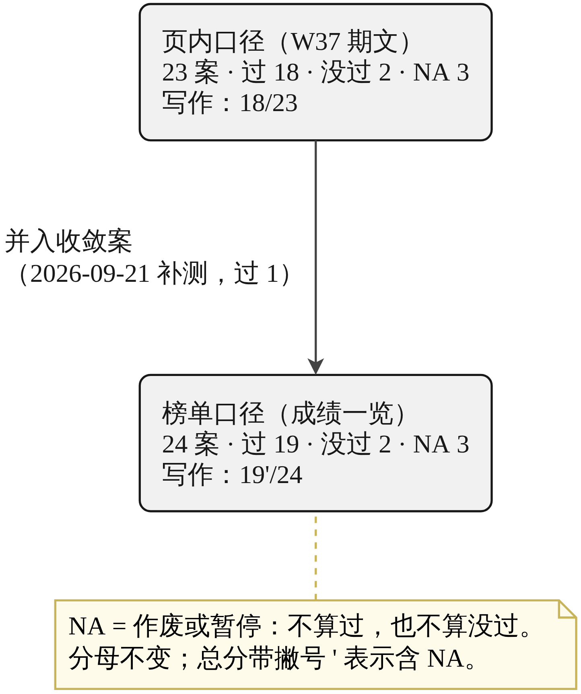
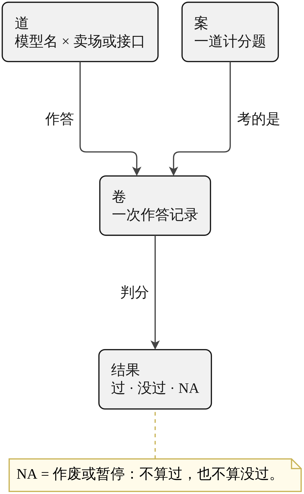
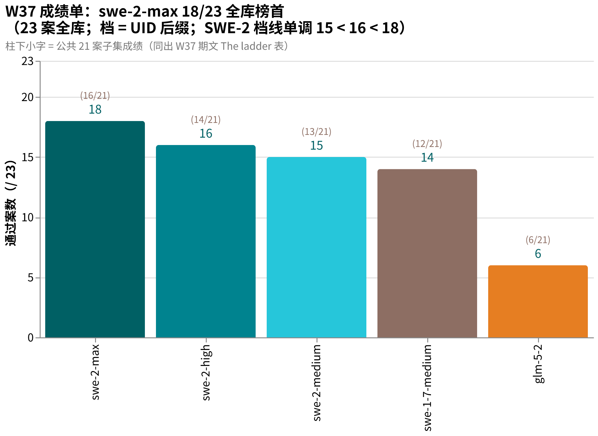
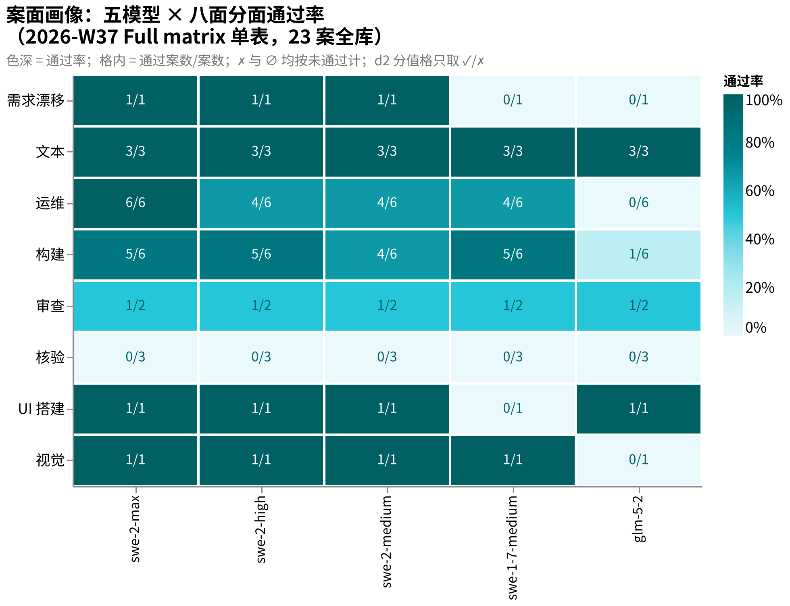

[English](README.en.md) · 简体中文

# amber-devin

> ⚠️ **更正（2026-10-02，另一项）**：防御轴的一案 A-d511f9e8 在所有车道上改记 NA（考场判的不是考生交付的文件，判分还要求了题面没写的事）。分母不变，**过案数不变**，每条道的总分都带 `'`。本仓各期成绩表里这一格请按 NA 读，其余内容保留原样，以[更正声明](https://github.com/getaskclaw/amber/blob/main/docs/corrections-2026-10-02-a-d511f9e8.md)为准。

> **2026-10-07 更新**：A-cdc3d11a（审查）：某个审查案上，判分器把一条格式正确的发现里的每个小点都当成一条未经证实的独立断言，又把答案清单之外的真实缺陷当成误报，所以一份正确、格式规范的审查报告也到不了及格线；该案在所有车道上挂起，分母不变，待判分器和考场修好、重新补考后再定。本车道（swe-2-max @ Devin）这一格改记 NA（挂起），不记负；该案由负改记 NA 的车道共 27 条（全库范围），没有重新考试，也不对任何模型的能力下结论。过案数不变（榜上 19'/24）；负案 3→2，NA 2→3；审查轴 1/2 不变、另有 1 个 NA。[2026-W37 期文](results/2026-W37.md)的 Full matrix 里 swe-2-max 列该格已照此改记，其余各列和图表未动。见[规范仓 2026-10-07 的更正（A-cdc3d11a）](https://github.com/getaskclaw/amber/blob/main/docs/corrections-2026-10-07-a-cdc3d11a.md)。

用私有题库 **AMBER** 实测 Devin 系模型（swe 系列等，含不同推理档位），只公开结果，不公开题目。

**一句话看懂**：榜单上 swe-2-max 的总成绩是 **19'/24**（24 案，撇号表示含 NA），下面的图解释这个数字从哪来。

## 成绩一览

<!-- scoreboard:start -->

| 大类 | 轴 | 考什么 | swe-2-max · [W37](results/2026-W37.md) |
|---|---|---|:-:|
| 施工面 | 编码 | 照着需求把功能写对 | 5/6 |
|  | 交付 | 做完还得交得出东西 | 3/3 |
|  | 运维 | 照规程干脏活 | 6/6 |
|  | 需求 | 客户要 A 不要 B | 1/1 |
|  | 收敛 | 真干完，不绕圈装忙 | 1/1 |
| 判断面 | UI | 照设计稿做页面 | 1/1 |
|  | 视觉 | 给真截图挑毛病 | 1/1 |
|  | 防御 | 堵死校验器的漏网口 | 0/2 · 1 NA |
|  | 归因 | 毛病对到正确根因 | 0/1 · 1 NA |
|  | 审查 | 给别人的交付物挑错 | 1/2 · 1 NA |
|  | **合计** |  | **19'/24** |

每格 = 过了几案/该轴共几案（案 = 一道计分题）。NA = 这一案作废或暂停计分，不算过也不算没过；总分带 `'` 表示其中有 NA。多数轴只有 1–2 案，差一案读数就变，所以别把小差距当结论。各列考试周次相同（W37），具体日期可能不同，数字是当期快照。

<!-- scoreboard:end -->

## 两个数字为什么不一样

- **18/23**：本期期文（2026-W37）页内的数字，共 23 案，不含之后并入的收敛案。
- **19'/24**：榜单上的总成绩，共 24 案（23 案 + 收敛案 1 案）。撇号表示其中含 NA。
- 想看 swe-2-max 现在的总成绩，看榜单的 **19'/24**。

## 这是什么

- 下图四个词就够读懂本仓：

- **道**：同一个模型名在某一家卖场或接口上的通道。同名模型在不同家，算不同的道。
- **案**：一道计分题，是分母的单位。公开页面只用别名 `A-xxxxxxxx`。
- **卷**：一次作答记录。同一案可以有多卷（同题的几个变体场次）。
- **NA**：这一案作废或暂停，不算过，也不算没过。

- 每期一篇 `results/YYYY-Www.md`：同题、同 harness（跑考试并记分的程序），对目标模型跑全库；同模型不同 effort 档（思考力度档位）位并排。
- 一期固定报告：题集规模与哈希、每案找茬分（d2 分，我们的打分，算法不公开）与通过/失败、终端终态（程序跑完时的退出状态）、token 用量（若车道上报）与时延、环境指纹、按证据纪律写的定性裁决。
- 题目、oracle（判分器）、transcript（答题全过程记录）、中间产物**永不公开**（见下「发布纪律」）。
- 姐妹仓：[amber-gpt](https://github.com/getaskclaw/amber-gpt)（GPT 系周测）、[amber-crof](https://github.com/getaskclaw/amber-crof)（CrofAI 周测）、[amber-ollama](https://github.com/getaskclaw/amber-ollama)（Ollama Cloud 周测）、[amber-workbuddy](https://github.com/getaskclaw/amber-workbuddy)（WorkBuddy ACP 道）、[amber-commandcode](https://github.com/getaskclaw/amber-commandcode)、[amber-deepseek](https://github.com/getaskclaw/amber-deepseek)、[amber-doubao](https://github.com/getaskclaw/amber-doubao)、[amber-goldenpotato](https://github.com/getaskclaw/amber-goldenpotato)、[amber-kimi](https://github.com/getaskclaw/amber-kimi)、[amber-opencode](https://github.com/getaskclaw/amber-opencode)、[amber-stepfun](https://github.com/getaskclaw/amber-stepfun)。
- AMBER 是 agentic 实战题库（施工/运维/审查/视觉/需求漂移——题中要求中途变化），规范与制题工具见 [getaskclaw/amber](https://github.com/getaskclaw/amber)；考题本体私有。

## 发布纪律（红线）

1. 只发：分数与聚合、token 用量（若车道上报）、速度、定性裁决。
2. 永不发：题目内容、oracle/判分器、transcript、考生工作区、任何能复原题面的中间产物。
3. 每期必钉：模型 ID、effort 档、日期（UTC）、harness 版本、每案内容哈希（bundle_sha，每题内容的哈希指纹）。哈希用于对照 [amber](https://github.com/getaskclaw/amber) 的公开哈希清单，自证题集未变。
4. 案号与题目结构属私有面：公开结果里案例只用稳定别名（A-xxxxxxxx，哈希派生）+ bundle 哈希作句柄；内部案号、变体名、题目描述永不出现。
5. 基调：这是社区实测，不是对厂商的攻击。数据说话，措辞克制。

## 一个方法论前提

同名模型、同 provider，两次跑也可能不同分——推理参数、负载、服务端版本都在漂。所以这里的一切结论都带日期与档位，且定期重测。单日数字是快照，不是定律。

## 图说数据

读法：柱子越高、颜色越深，过案越多。所有数字都是 W37 期的快照，不是定论。

- **本期成绩单**（2026-W37，23 案全库，数字出期文 The ladder 表）：swe-2-max 18/23 全库榜首，SWE-2 档线 medium 15 < high 16 ≈ high 二跑 15 < max 18（[2026-09-18 更正](results/2026-W37.md)：原记 swe-2-low 的成绩实为 swe-2-high 二跑，档线旧文 low 15 = medium 15 作废）；swe-1-7-medium 14/23，glm-5-2 6/23；柱下小字 = 公共 21 案子集。
  
- **案面画像**（2026-W37 Full matrix 单表，face × 模型热力图，色深 = 分面通过率）：swe-2-max 运维面 6/6 道内唯一全清（全场更早全清者：gpt luna 三档、ollama g53f）；SWE-2 四档 UI 搭建连过；核验面六模型全部 0/3。
  

## 结果索引

想看 swe-2-max 现在的总成绩，看榜单的 **19'/24**；下表的 **18/23** 是本期期文的页内数字（23 案，不含收敛案）。

| 期 | 内容 | 结论 |
|---|---|---|
| [2026-W37](results/2026-W37.md) | swe-1-7-medium + glm-5-2 + swe-2-high + swe-2-medium + swe-2-max + swe-2-low 六模型全库（23 案） | **swe-2-max 18/23（16/21）全库新榜首**，档线 medium 15 < high 16 ≈ high 二跑 15 < max 18（[2026-09-18 更正](results/2026-W37.md)：swe-2-low 不存在，该轮实为 swe-2-high 二跑），OPS 面 6/6 全清（道内唯一），代价 ~4 倍墙钟；swe-2-medium 15/23 最快全库 43 分钟+视觉 4.0 史上最高；swe-2-high 二跑 15/23 平 medium 但保住重判断案（原记 swe-2-low，Addendum 2026-09-12）；swe-1-7-medium 审查案首过无人继承；glm-5-2 6/23 交付契约零遵守=运行级失格 |

## 免责

与 Cognition 无任何隶属/赞助关系。分数是特定周、特定档位的快照，不构成采购建议。
